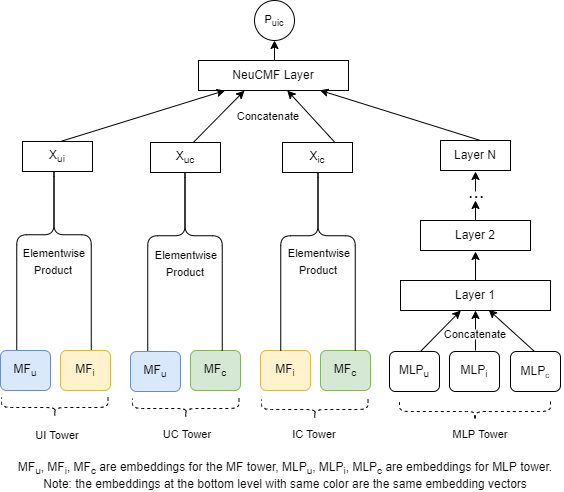

# DeepCARSKit

*A Deep Learning Based Context-Aware Recommendation Library*

[](./LICENSE)
[](https://carskit.github.io/)
[](https://badges.aleen42.com/src/python.svg)
[](https://scholar.google.com/citations?view_op=view_citation&hl=en&citation_for_view=0FENWMcAAAAJ:Bg7qf7VwUHIC)
[](https://doi.org/10.1016/j.simpa.2022.100292)

[](https://carskit.github.io/)


## History
+ **[CARSKit](https://github.com/irecsys/CARSKit)** was released in 2015, and it was the first open-source library for 
context-aware recommendations. There were no more significant updates in CARSKit since 2019. It was a library built based on Java and [Librec](https://github.com/guoguibing/librec) v1.3. 
There is a version in Python, [CARSKit-API](https://github.com/WagnoLeaoSergio/CARSKit_API), which is a python wrapper of CARSKit.
+ Recommender systems based on deep learning have been well-developed in recent years. The context-aware 
recommendation models based on traditional collaborative filtering (e.g., KNN-based CF, matrix factorization) turned out to 
be out-dated. Therefore, we develop and release [DeepCARSKit](https://github.com/irecsys/DeepCARSKit) which was built upon the [RecBole](https://recbole.io/) v1.0.0 recommendation library.
DeepCARSKit is *a Deep Learning Based Context-Aware Recommendation Library* which can be run with correct setting based on Python and [PyTorch](https://pytorch.org/).


## Feature
+ **Implemented Deep Context-Aware Recommendation Models.** Currently, we support the CARS models built based on factorization machines (FM) and 
Neural Collaborative Filtering (NeuCF and NeuMF). More algorithms will be added.

+ **Multiple Data Splits & Evaluation Options.** We provide evaluations based on both hold-out and N-fold cross validations.

+ **Extensive and Standard Evaluation Protocols.** We rewrite codes in RecBole to adapt the evaluations for context-aware recommendations.
Particularly, item recommendations can be produced for each unique combination of (user and context situation). Relevance and Ranking metrics, 
such as precision, recall, NDCG, MRR, can be calculated by taking context information into consideration.

+ **Autosave Best Logs.** DeepCARSKit can automatically save the best log/configuration of the models you run, in the folder of 'log/best/'.

+ **Other Features.** Other characteristic in DeepCARSKit are inherited from RecBole, suc as GPU accelerations.


## News & Updates
**03/19/2022**: We release DeepCARSKit v1.0.0

## Documents
+ [DeepCARSKit API](https://carskit.github.io/doc/DeepCARSKit/index.html)
+ [RecBole API](https://recbole.io/docs/)
+ Yong Zheng. "[DeepCARSKit: A Deep Learning Based Context-Aware Recommendation Library](https://doi.org/10.1016/j.simpa.2022.100292)", Software Impacts, Vol. 13, Elsevier, 2022
+ Yong Zheng. "[DeepCARSKit: A Demo and User Guide](https://doi.org/10.1145/3511047.3536417)", Adjunct Proceedings of the 30th ACM Conference on User Modeling, Adaptation and Personalization (ACM UMAP), Spain, July, 2022
+ Yong Zheng, Gonzalo Florez Arias. "[A Family of Neural Contextual Matrix Factorization Models for Context-Aware Recommendations](https://doi.org/10.1145/3511047.3536404)", Adjunct Proceedings of the 30th ACM Conference on User Modeling, Adaptation and Personalization (ACM UMAP), Spain, July, 2022


## Installation
DeepCARSKit works with the following operating systems:

* Linux
* Windows 10
* macOS X

DeepCARSKit requires Python version 3.7 or later, torch version 1.7.0 or later, and RecBole version 1.0.0 or later (v 1.1+ is not compatible with DeepCARSKit). 
For more details, you can refer to the list of [requirements](https://github.com/irecsys/DeepCARSKit/blob/main/requirements.txt).
If you want to use DeepCARSKit with GPU,
please ensure that CUDA or cudatoolkit version is 9.2 or later.
This requires NVIDIA driver version >= 396.26 (for Linux) or >= 397.44 (for Windows10).

More info about installation from conda and pip will be released later.
Currenly, you can make a git clone of the source codes. We will pulish it to pypi and conda in next release.

## Quick-Start
With the source code, you can use the provided script for initial usage of our library:

```bash
python run.py
```

This script will run the NeuCMFi model on the DePaulMovie dataset.

### Data Sets & Preparation
A list of available data sets for research on context-aware recommender systems can be found [here](https://github.com/irecsys/CARSKit/tree/master/context-aware_data_sets).
We provide two data sets (i.e., DePaulMovie and TripAdvisor) in the library. You can refer to its data format, such as [depaulmovie.inter](https://github.com/irecsys/DeepCARSKit/blob/main/dataset/depaulmovie/depaulmovie.inter).

More specifically, you need to prepare a data set looks like this: (use 'float' and 'token' to indicate numerical and nominal variables)

+ user_id:token
+ item_id:token
+ rating:float
+ context variable 1:token
+ context variable 2:token
+ context variable N:token
+ contexts:token => a concatenation of context conditions
+ uc_id:token => a concatenation of user_id and contexts

### Algorithms in NeuCMF Framework
An extensive NeuCMF framework is included in the DeepCARSKit library. There are multiple variants of the NeuCMF models in this framework.

[](https://carskit.github.io/)


### Hyperparameter tuning 
You can tune up the parameters from the configuration file, config.yaml

A user guide with more and more details is on the way...


## Major Releases
| Releases  | Date       |
|-----------|------------|
| v1.0.0    | 03/19/2022 |


## Cite
If you find DeepCARSKit useful for your research or development, please cite the following paper:

```
@article{deepcarskit,
    title={DeepCARSKit: A Deep Learning Based Context-Aware Recommendation Library},
    author={Zheng, Yong},
    journal={Software Impacts},
    volume={13},
    pages={100292},
    year={2022},
    publisher={Elsevier}
}
```
## Contributing
Pull requests are welcome. For major changes, please open an issue first to discuss what you would like to change.
Please make sure to update tests as appropriate.

We welcome collaborations and contributors to the DeepCARSKit. Your names will be listed here.

## Sponsors
The current project was supported by Google Cloud Platform. We are looking for more sponsors to support the development and distribution of this libraray.
If you are interested in sponsorship, please let me know. Our official email is DeepCARSKit [at] gmail [dot] com.

## License
[MIT License](./LICENSE)
